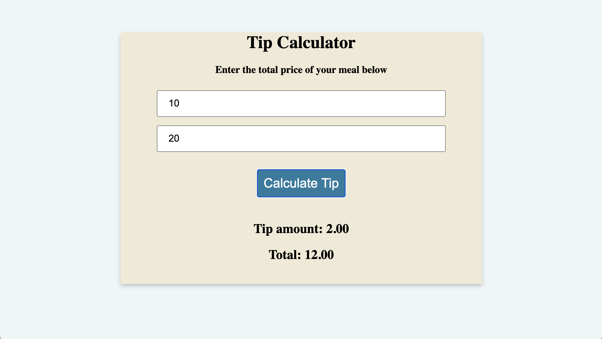

# tip-calculator

When a user enters numbers in the text fields and clicks on the Calculate Tip button, calculated totals for both the tip amount and total should appear on screen.

### The following image demonstrates the web application's appearance and functionality:



#### The toFixed() method rounds the string to a specified number of decimals.

```
// render amounts on the page
    tipSpanElement.textContent = tipAmount.toFixed(2);
    totalSpanElement.textContent = total.toFixed(2);
```
